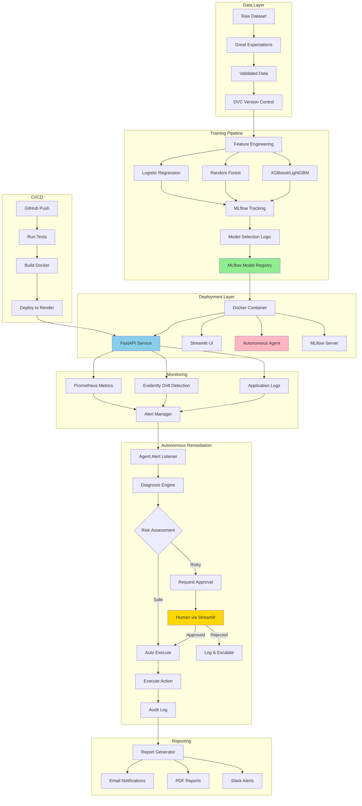

# MLOps Platform Architecture

## 🏗️ System Architecture Overview

This is a production-grade MLOps platform with autonomous remediation capabilities, designed for continuous model training, deployment, monitoring, and intelligent self-healing.

---

## 📊 ASCII Architecture Diagram

```
┌─────────────────────────────────────────────────────────────────────────────┐
│                            MLOps Platform Overview                           │
└─────────────────────────────────────────────────────────────────────────────┘

┌──────────────────────────────────────────────────────────────────────────────┐
│  DATA LAYER                                                                   │
├──────────────────────────────────────────────────────────────────────────────┤
│                                                                               │
│  ┌──────────────┐      ┌──────────────┐      ┌──────────────┐              │
│  │ Raw Dataset  │─────▶│ Great        │─────▶│ Validated    │              │
│  │ (UCI/Kaggle) │      │ Expectations │      │ Dataset      │              │
│  └──────────────┘      │ (Schema +    │      └──────┬───────┘              │
│                        │  Quality)    │             │                       │
│                        └──────────────┘             │                       │
│                                                      ▼                       │
│                                              ┌──────────────┐               │
│                                              │ DVC Storage  │               │
│                                              │ (Versioned)  │               │
│                                              └──────────────┘               │
└──────────────────────────────────────────────────────────────────────────────┘

┌──────────────────────────────────────────────────────────────────────────────┐
│  TRAINING & EXPERIMENTATION LAYER                                            │
├──────────────────────────────────────────────────────────────────────────────┤
│                                                                               │
│  ┌─────────────────────────────────────────────────────────────────┐        │
│  │  Training Pipeline (training/train_pipeline.py)                  │        │
│  │                                                                   │        │
│  │  ┌──────────────┐  ┌──────────────┐  ┌──────────────┐          │        │
│  │  │ Logistic     │  │ Random       │  │ XGBoost/     │          │        │
│  │  │ Regression   │  │ Forest       │  │ LightGBM     │          │        │
│  │  └──────┬───────┘  └──────┬───────┘  └──────┬───────┘          │        │
│  │         │                  │                  │                  │        │
│  │         └──────────────────┼──────────────────┘                  │        │
│  │                            ▼                                     │        │
│  │                  ┌──────────────────┐                            │        │
│  │                  │ MLflow Tracking  │◀───── Hyperparameters      │        │
│  │                  │ (Log all runs)   │       Metrics, Artifacts   │        │
│  │                  └────────┬─────────┘                            │        │
│  │                           │                                      │        │
│  │                           ▼                                      │        │
│  │                  ┌──────────────────┐                            │        │
│  │                  │ Model Selector   │                            │        │
│  │                  │ (Best by F1/AUC) │                            │        │
│  │                  └────────┬─────────┘                            │        │
│  │                           │                                      │        │
│  │                           ▼                                      │        │
│  │                  ┌──────────────────┐                            │        │
│  │                  │ MLflow Registry  │                            │        │
│  │                  │ (Production)     │                            │        │
│  │                  └──────────────────┘                            │        │
│  └─────────────────────────────────────────────────────────────────┘        │
└──────────────────────────────────────────────────────────────────────────────┘

┌──────────────────────────────────────────────────────────────────────────────┐
│  DEPLOYMENT LAYER                                                            │
├──────────────────────────────────────────────────────────────────────────────┤
│                                                                               │
│  ┌────────────────────────────────────────────────────────────┐             │
│  │  Docker Containers                                          │             │
│  │                                                             │             │
│  │  ┌──────────────────┐  ┌──────────────────┐               │             │
│  │  │  FastAPI Service │  │  Streamlit UI    │               │             │
│  │  │  /predict        │  │  Dashboard       │               │             │
│  │  │  /health         │  │  - Metrics       │               │             │
│  │  │  /metrics        │  │  - Drift view    │               │             │
│  │  └────────┬─────────┘  │  - Approvals     │               │             │
│  │           │            └──────────────────┘               │             │
│  │           │                                               │             │
│  │           │            ┌──────────────────┐               │             │
│  │           │            │  Autonomous      │               │             │
│  │           │            │  Agent Service   │               │             │
│  │           │            │  (remediation)   │               │             │
│  │           │            └──────────────────┘               │             │
│  │           │                                               │             │
│  │           │            ┌──────────────────┐               │             │
│  │           │            │  MLflow Server   │               │             │
│  │           │            └──────────────────┘               │             │
│  │           │                                               │             │
│  │           │            ┌──────────────────┐               │             │
│  │           └───────────▶│  Prometheus      │               │             │
│  │                        │  (Metrics)       │               │             │
│  │                        └──────────────────┘               │             │
│  └────────────────────────────────────────────────────────────┘             │
│                                                                               │
│  Deployed on: Render (Web Services + Docker)                                │
└──────────────────────────────────────────────────────────────────────────────┘

┌──────────────────────────────────────────────────────────────────────────────┐
│  MONITORING & OBSERVABILITY LAYER                                            │
├──────────────────────────────────────────────────────────────────────────────┤
│                                                                               │
│  ┌──────────────────┐  ┌──────────────────┐  ┌──────────────────┐          │
│  │  Evidently       │  │  Prometheus      │  │  Application     │          │
│  │  - Data Drift    │  │  - API Metrics   │  │  Logs            │          │
│  │  - Model Drift   │  │  - Request Rate  │  │  (Structured)    │          │
│  │  - Target Drift  │  │  - Latency       │  │                  │          │
│  └────────┬─────────┘  └────────┬─────────┘  └────────┬─────────┘          │
│           │                     │                     │                     │
│           └─────────────────────┼─────────────────────┘                     │
│                                 ▼                                           │
│                        ┌──────────────────┐                                 │
│                        │  Alert Manager   │                                 │
│                        │  (Thresholds)    │                                 │
│                        └────────┬─────────┘                                 │
│                                 │                                           │
│                                 ▼                                           │
│                    ┌────────────────────────┐                               │
│                    │  Notification Service  │                               │
│                    │  - Email (SMTP)        │                               │
│                    │  - Slack Webhook       │                               │
│                    │  - Autonomous Agent    │                               │
│                    └────────────────────────┘                               │
└──────────────────────────────────────────────────────────────────────────────┘

┌──────────────────────────────────────────────────────────────────────────────┐
│  AUTONOMOUS REMEDIATION LAYER                                                │
├──────────────────────────────────────────────────────────────────────────────┤
│                                                                               │
│  ┌────────────────────────────────────────────────────────────────┐         │
│  │  Autonomous Agent (agent/agent_service.py)                      │         │
│  │                                                                  │         │
│  │  ┌──────────────────┐                                           │         │
│  │  │  Alert Listener  │  ◀──── Webhooks from Prometheus/Evidently │         │
│  │  └────────┬─────────┘                                           │         │
│  │           │                                                     │         │
│  │           ▼                                                     │         │
│  │  ┌──────────────────┐                                           │         │
│  │  │  Diagnosis Engine│                                           │         │
│  │  │  - Parse metrics │                                           │         │
│  │  │  - Classify issue│                                           │         │
│  │  │  - Severity score│                                           │         │
│  │  └────────┬─────────┘                                           │         │
│  │           │                                                     │         │
│  │           ▼                                                     │         │
│  │  ┌──────────────────┐                                           │         │
│  │  │  Decision Engine │                                           │         │
│  │  │                  │                                           │         │
│  │  │  Safe Actions:   │                                           │         │
│  │  │  - Log issue     │                                           │         │
│  │  │  - Scale service │                                           │         │
│  │  │  - Clear cache   │                                           │         │
│  │  │                  │                                           │         │
│  │  │  Risky Actions:  │                                           │         │
│  │  │  - Retrain model │ ─────▶ Request Human Approval            │         │
│  │  │  - Rollback      │        (via Streamlit UI)                │         │
│  │  │  - Deploy new    │                                           │         │
│  │  └────────┬─────────┘                                           │         │
│  │           │                                                     │         │
│  │           ▼                                                     │         │
│  │  ┌──────────────────┐                                           │         │
│  │  │  Action Executor │                                           │         │
│  │  │  - Execute plan  │                                           │         │
│  │  │  - Log to audit  │                                           │         │
│  │  │  - Monitor result│                                           │         │
│  │  └──────────────────┘                                           │         │
│  └────────────────────────────────────────────────────────────────┘         │
└──────────────────────────────────────────────────────────────────────────────┘

┌──────────────────────────────────────────────────────────────────────────────┐
│  GOVERNANCE & REPORTING LAYER                                                │
├──────────────────────────────────────────────────────────────────────────────┤
│                                                                               │
│  ┌──────────────────┐  ┌──────────────────┐  ┌──────────────────┐          │
│  │  Audit Log DB    │  │  Report Generator│  │  Human Approval  │          │
│  │  (SQLite/Postgres│  │  (Jinja2 → PDF)  │  │  Queue           │          │
│  │   All actions)   │  │  - Deploy report │  │  (Streamlit)     │          │
│  │                  │  │  - Drift report  │  │                  │          │
│  └──────────────────┘  │  - Incident log  │  └──────────────────┘          │
│                        └──────────────────┘                                 │
└──────────────────────────────────────────────────────────────────────────────┘

┌──────────────────────────────────────────────────────────────────────────────┐
│  CI/CD PIPELINE                                                              │
├──────────────────────────────────────────────────────────────────────────────┤
│                                                                               │
│  GitHub Actions Workflow:                                                    │
│                                                                               │
│  1. Code Push → GitHub                                                       │
│  2. Run Tests (pytest)                                                       │
│  3. Lint & Format (black, ruff)                                              │
│  4. Build Docker Images                                                      │
│  5. Push to Registry (Docker Hub / GitHub Container Registry)               │
│  6. Deploy to Render                                                         │
│     - FastAPI service                                                        │
│     - Streamlit UI                                                           │
│     - Agent service                                                          │
│     - MLflow server                                                          │
│  7. Run smoke tests                                                          │
│  8. Send deployment report (Email + Slack)                                   │
│                                                                               │
└──────────────────────────────────────────────────────────────────────────────┘
```

---

## 🎯 Mermaid Architecture Diagram



---

## 🔄 Data Flow Explanation

### 1. **Data Ingestion & Validation**
- Dataset automatically selected (UCI Heart Disease as default - balanced, tabular, well-suited for MLOps)
- Great Expectations validates schema, data types, ranges, null values
- DVC versions the dataset with git-like semantics
- Invalid data triggers alerts before training

### 2. **Training & Experimentation**
- Pipeline trains 3+ models in parallel
- Each model logs to MLflow:
  - Hyperparameters
  - Metrics (accuracy, F1, AUC-ROC, precision, recall)
  - Confusion matrix
  - Feature importance
  - Model artifacts
- Model selector compares F1 scores (configurable)
- Best model promoted to "Production" stage in MLflow Registry
- Artifacts stored with version tags

### 3. **Deployment**
- Docker containers built for each service
- FastAPI serves predictions with `/predict` endpoint
- Health checks at `/health`
- Prometheus metrics at `/metrics`
- Streamlit UI provides:
  - Model comparison dashboard
  - Drift visualizations
  - Approval interface for agent actions
  - Historical performance trends
- Deployed to Render via GitHub Actions

### 4. **Monitoring**
- **Evidently** monitors:
  - Data drift (input feature distributions)
  - Target drift (prediction distributions)
  - Model quality drift (performance degradation)
- **Prometheus** tracks:
  - Request rate, latency, error rate
  - Model inference time
  - Custom business metrics
- **Logs**: Structured JSON logs for debugging

### 5. **Autonomous Remediation**
- Agent listens to webhooks from Prometheus/Evidently
- **Diagnosis**: Analyzes alert context (drift score, error rate, etc.)
- **Decision Tree**:
  - **Low severity** → Auto-fix (cache clear, scale up)
  - **Medium severity** → Request approval (retrain)
  - **High severity** → Escalate to human + rollback
- **Execution**: Triggers retraining pipeline or rollback
- **Audit**: All actions logged with timestamps, reasons, outcomes

### 6. **Human-in-the-Loop**
- Streamlit dashboard shows pending approvals
- Human reviews:
  - Alert details
  - Proposed action
  - Predicted impact
- Approves or rejects
- Agent proceeds or escalates based on decision

### 7. **Reporting & Governance**
- Jinja2 templates generate HTML reports
- Converted to PDF (WeasyPrint)
- Reports include:
  - Deployment summary
  - Model comparison table
  - Drift analysis charts
  - Incident timeline
- Emailed to stakeholders
- Stored in audit database (SQLite → Postgres for production)

---

## 🎬 Alert → Remediation Flow

```
1. Drift Detected (Evidently)
   ↓
2. Alert sent to Prometheus Alert Manager
   ↓
3. Webhook → Autonomous Agent
   ↓
4. Agent diagnoses: "Data drift > 0.7"
   ↓
5. Decision: "Retrain model" (RISKY)
   ↓
6. Agent creates approval request
   ↓
7. Notification sent (Email + Streamlit UI badge)
   ↓
8. Human logs into Streamlit
   ↓
9. Reviews drift charts + proposal
   ↓
10. Clicks "Approve Retrain"
   ↓
11. Agent triggers training pipeline
   ↓
12. New model trained & evaluated
   ↓
13. If better → Deploy to production
   ↓
14. If worse → Keep current model
   ↓
15. Generate & send deployment report
   ↓
16. Log to audit database
```

---

## 🛡️ Safety & Governance Features

### Approval Tiers
| Action | Auto-Execute | Requires Approval | Human Only |
|--------|-------------|-------------------|------------|
| Log error | ✅ | ❌ | ❌ |
| Send alert | ✅ | ❌ | ❌ |
| Scale service | ✅ | ❌ | ❌ |
| Clear cache | ✅ | ❌ | ❌ |
| Retrain model | ❌ | ✅ | ❌ |
| Deploy new model | ❌ | ✅ | ❌ |
| Rollback | ❌ | ✅ | ❌ |
| Delete data | ❌ | ❌ | ✅ |
| Change config | ❌ | ✅ | ❌ |

### Audit Trail
- Every action logged with:
  - Timestamp
  - Trigger (alert, human, scheduled)
  - Agent decision reasoning
  - Human approver (if applicable)
  - Outcome (success/failure)
  - Impact metrics (before/after comparison)

---

## 📦 Technology Stack Summary

| Layer | Technology | Purpose |
|-------|-----------|---------|
| **Data Validation** | Great Expectations | Schema & quality checks |
| **Data Versioning** | DVC | Dataset version control |
| **ML Framework** | Scikit-learn, XGBoost, LightGBM | Model training |
| **Experiment Tracking** | MLflow | Run tracking & model registry |
| **Inference API** | FastAPI | REST API for predictions |
| **UI Dashboard** | Streamlit | Visualization & approvals |
| **Drift Monitoring** | Evidently | Data/model drift detection |
| **Metrics** | Prometheus | System & business metrics |
| **Containerization** | Docker | Service isolation |
| **Orchestration** | Docker Compose | Local multi-service setup |
| **CI/CD** | GitHub Actions | Automated deployment |
| **Hosting** | Render | Cloud deployment |
| **Notifications** | SMTP, Slack | Alerts & reports |
| **Reporting** | Jinja2, WeasyPrint | PDF report generation |
| **Database** | SQLite → PostgreSQL | Audit logs & metadata |
| **Agent Logic** | Python (custom) | Autonomous remediation |

---

## 🎯 Key Design Principles

1. **Modularity**: Each component is independent and replaceable
2. **Observability**: Every layer emits metrics, logs, and traces
3. **Safety**: Human approval for risky actions
4. **Reproducibility**: DVC + MLflow ensure full lineage
5. **Scalability**: Containerized services can scale independently
6. **Automation**: Reduce manual intervention while maintaining control
7. **Transparency**: All decisions logged and explainable

---

## 🔐 Security Considerations

- **Secrets Management**: Environment variables + `.env` (not committed)
- **API Authentication**: API keys for FastAPI endpoints
- **Render Secrets**: Stored in Render dashboard
- **Webhook Validation**: HMAC signatures for agent webhooks
- **RBAC**: Role-based access for approvals (future: OAuth)
- **Audit Logs**: Immutable append-only logs

---

## 🚀 Scalability Path

**Current (MVP)**:
- Single Docker Compose deployment
- SQLite database
- Local MLflow server

**Future (Production)**:
- Kubernetes deployment
- PostgreSQL with replicas
- Managed MLflow (Databricks or AWS)
- Redis for caching
- Kafka for event streaming
- Ray/Dask for distributed training

---

This architecture provides a complete end-to-end MLOps platform with intelligent automation, human oversight, and production-grade monitoring and governance.
